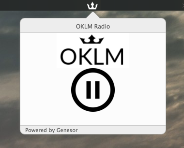

# OKLM Radio Menubar

OKLM radio on macOS with media keys (play/pause) support

## Screenshot



## Download

The app is available [here](http://sadoma.so/OKLM.zip) for direct use

## Building from source

If you want to build the app for Windows or Linux feel free to clone the repo and build it for your own OS.

Install all dependencies :
```
$ npm install
```

Launch the app from source code without building:
```
$ npm start
```

Build the app:
- I used **electron-packager** to build it for macOS so feel free to follow the [documentation](https://github.com/electron-userland/electron-packager) to make your own build.